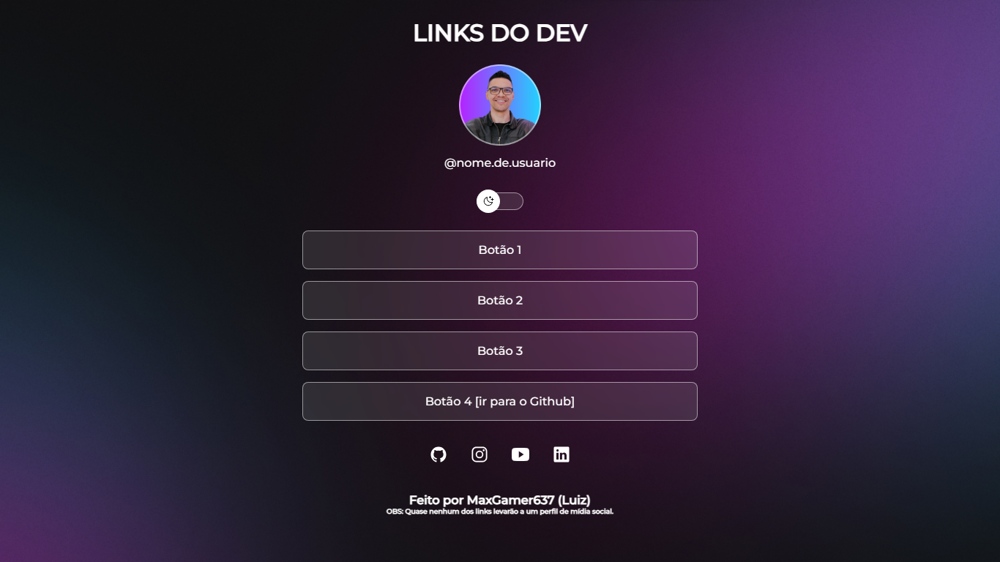

<h1 align="center"> Links Do DEV </h1>

Um simples agrupador de links para você não encher sua 'bio' de links!  
Projeto feito com o conhecimento oferecido pela <a href="https://rocketseat.com.br">RocketSeat!</a>

  <a href="#-tecnologias">Tecnologias</a>&nbsp;&nbsp;&nbsp;|&nbsp;&nbsp;&nbsp;
  <a href="#-projeto">Projeto</a>&nbsp;&nbsp;&nbsp;|&nbsp;&nbsp;&nbsp;
  <a href="#-layout">Layout</a>&nbsp;&nbsp;&nbsp;|&nbsp;&nbsp;&nbsp;
  <a href="#-licença">Licença</a>

 

  

## 🚀 Tecnologias

Esse projeto foi desenvolvido com:

- HTML e CSS
- JavaScript
- Git e Github
- Figma

## 💻 Projeto

O Links Do DEV é um agrupador de links para usar como se fosse um pequeno cartão de visitas online, permitindo a que quem visite consiga ver o que você faz.

[Clique aqui para ver o projeto!](https://maxgamer637.github.io/rcktseat-LinksDoDev/)

## 🔖 Layout

O layout (esperado) do projeto está [aqui](https://www.figma.com/community/file/1187422022288947321).<h6>Você precisa ser cadastrado no [Figma](https://figma.com) para ver. </h6>

## 📃 Licença

Licença MIT.

---

Feito por [MaxGamer637](https://github.com/MaxGamer637)
